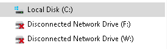
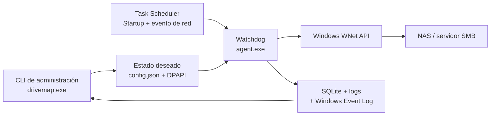

<div align="center">
  <h1>DrivePulse</h1>
  <p><strong>Mantiene las unidades de red de Windows disponibles y las recupera automáticamente, sin intervención manual después de un reinicio o una caída del NAS.</strong></p>

  <!-- TODO: agregar un banner propio de DrivePulse; el repositorio aún no incluye este asset. -->

  <p>
    <a href="https://github.com/castellanosfelipe/DrivePulse/releases/tag/v1.0.2"></a>
    
    
    <a href="https://github.com/castellanosfelipe/DrivePulse/actions/workflows/build-windows.yml"></a>
  </p>

  <p>
    <a href="https://github.com/castellanosfelipe/DrivePulse"></a>
    <a href="https://www.linkedin.com/in/bairon-felipe-peña-castellanos-ab18411b5?utm_source=share_via&amp;utm_content=profile&amp;utm_medium=member_ios"></a>
  </p>
</div>

---

## 📋 Tabla de contenidos

- [¿Qué es DrivePulse?](#que-es-drivepulse)
- [Demo en vivo](#demo-en-vivo)
- [Características principales](#caracteristicas-principales)
- [Capturas de pantalla](#capturas-de-pantalla)
- [Instalación rápida](#instalacion-rapida)
- [Cómo usar](#como-usar)
- [Arquitectura](#arquitectura)
- [Roadmap](#roadmap)
- [Contribuir](#contribuir)
- [Licencia](#licencia)

<a id="que-es-drivepulse"></a>

## 🎯 ¿Qué es DrivePulse?

DrivePulse es un producto de continuidad operativa para equipos Windows que dependen de unidades SMB. Convierte un procedimiento manual y repetitivo —reconectar letras después de cada reinicio o interrupción— en una capacidad automática, observable y preparada para operar sin internet.

La versión `1.0.2` incorpora instalación transaccional de un comando, validación de heartbeat y compatibilidad verificada del XML con Windows Task Scheduler. La aceptación final de tiempos de recuperación continúa pendiente en los tres equipos Windows y el NAS Synology reales.

### El problema que resuelve

Cuando una unidad de red aparece con una X roja, aplicaciones como ABBYY pueden perder acceso a documentos esenciales sin avisar claramente al operador. El resultado es trabajo interrumpido, diagnósticos tardíos y una reconexión manual que debe repetirse después de reinicios o caídas del NAS.

### La solución

DrivePulse vigila el acceso real, limpia conexiones fantasma y reconstruye las unidades en la sesión correcta de Windows. Además, protege las credenciales, detiene intentos que podrían bloquear la cuenta y deja evidencia útil para soporte.

### ¿Para quién es?

| Audiencia | Beneficio clave |
|---|---|
| Equipos de infraestructura y soporte | Menos tickets repetitivos y diagnóstico accionable con `drivemap doctor`. |
| Responsables de ABBYY y automatizaciones | Acceso continuo a repositorios SMB después de reinicios y microcortes. |
| Líderes de producto y operaciones | Menor dependencia de procedimientos manuales y trazabilidad del estado del servicio. |

<a id="demo-en-vivo"></a>

## 🎬 Demo en vivo

El repositorio todavía no incluye un video o GIF verificable. La demostración prevista debe mostrar el flujo completo: unidad desconectada → detección del watchdog → reparación → estado `connected`.

<!-- TODO: agregar assets/demo.gif del flujo principal después del piloto en Windows real. -->

Mientras se captura esa evidencia, el recorrido funcional puede validarse con:

```powershell
drivemap status
drivemap apply
drivemap logs --tail 50
```

<a id="caracteristicas-principales"></a>

## ✨ Características principales

| Feature | Descripción |
|---|---|
| 🔄 **Autorreparación continua** | Detecta unidades ausentes, desconectadas o apuntando al destino incorrecto y las reconstruye automáticamente. |
| 🚀 **Recuperación desde el arranque** | Combina inicio de Windows, evento de conexión de red y watchdog para evitar carreras con una NIC o un NAS que aún no están listos. |
| 🔐 **Credenciales protegidas** | Usa DPAPI de máquina y ACL restrictivas; la contraseña nunca se acepta como argumento ni aparece en texto plano. |
| 🛡️ **Reintentos seguros** | Aplica backoff a fallos transitorios y detiene intentos ante credenciales inválidas o una cuenta bloqueada. |
| 📊 **Diagnóstico y trazabilidad** | Expone estado, incidentes, logs, Event Log y checks de red, SMB, ACL y tareas mediante el CLI. |
| 📦 **Operación 100 % offline** | El paquete incluye runtime congelado, wheels vendorizados e instalación sin Python, PsExec, NSSM o acceso a internet. |

<a id="capturas-de-pantalla"></a>

## 📸 Capturas de pantalla

### Antes de DrivePulse: unidades desconectadas

<div align="center">
  
  <p><em>El estado que origina el problema: las letras siguen visibles, pero la sesión SMB ya no está disponible para el proceso consumidor.</em></p>
</div>

DrivePulse es deliberadamente un producto CLI-first y no incluye dashboard web en v1. Esto reduce la superficie de ataque de un proceso que opera como `SYSTEM`.

<!-- TODO: agregar una captura de drivemap doctor y otra de status después del piloto, sin incluir hosts, usuarios o datos sensibles. -->

<a id="instalacion-rapida"></a>

## 🚀 Instalación rápida

### Prerrequisitos

- Windows 10 Pro 22H2 x64 o Windows Server 2016+.
- PowerShell 5.1 y una sesión con privilegios de administrador.
- Acceso autorizado por TCP/445 al servidor SMB.
- Usuario y contraseña vigentes para los *shares*.

> El equipo destino no necesita Python, internet, PsExec ni herramientas de terceros.

### Pasos

1. Desde un equipo con internet, descargue los tres assets de la [última release de DrivePulse](https://github.com/castellanosfelipe/DrivePulse/releases/latest): ZIP, instalador `.ps1` y `.sha256`.
2. Copie los tres archivos a la misma carpeta de la máquina Windows offline.
3. Abra PowerShell como administrador en esa carpeta.
4. Ejecute un solo comando, sustituyendo `<versión>` por el nombre descargado:

```powershell
powershell.exe -NoProfile -ExecutionPolicy Bypass -File .\DrivePulse-<versión>-install.ps1
```

El instalador verifica el SHA-256, extrae el paquete temporalmente, actualiza
sin sobrescribir procesos activos y valida el heartbeat. Si todo está correcto,
verá: `DriveMapper instalado correctamente.`

Si ya extrajo el ZIP, el comando equivalente es:

```powershell
powershell.exe -NoProfile -ExecutionPolicy Bypass -File .\install.ps1
```

Para construir el paquete desde el repositorio:

```powershell
git clone https://github.com/castellanosfelipe/DrivePulse.git
Set-Location .\DrivePulse
.\build.ps1
```

El build instala dependencias exclusivamente desde `wheelhouse`, ejecuta las pruebas y produce `dist\DriveMapper\`.

<a id="como-usar"></a>

## 💡 Cómo usar

### Caso de uso básico

Agregue una unidad. La contraseña se solicita mediante prompt oculto:

```powershell
drivemap add --id minvivienda --letter W: `
  --unc \\192.168.230.245\minvivienda `
  --user workgroup\readuser `
  --scope system

drivemap status
```

### Configuración inicial de referencia

```powershell
drivemap add --id seguridad --letter Z: `
  --unc \\192.168.230.245\seguridad `
  --user workgroup\readuser `
  --scope system

drivemap add --id minvdomustemp --letter F: `
  --unc \\192.168.230.245\minvdomustemp `
  --user workgroup\readuser `
  --scope system
```

### Diagnóstico de prerrequisitos

```powershell
drivemap doctor
drivemap status --json
drivemap logs --tail 200
```

`doctor` no modifica el equipo: revisa privilegios, tareas, TCP/445, sesiones SMB, letras, secretos y ACL, y propone una acción correctiva por hallazgo.

### Rotación segura de credenciales

```powershell
drivemap set seguridad --password
```

El flag activa un prompt oculto; el valor de la contraseña no se escribe en la línea de comandos.

### Exportar sin secretos

```powershell
drivemap export C:\Temp\drives-without-secrets.json
drivemap import C:\Temp\drives-without-secrets.json
```

Consulte la [guía de operación](docs/USER_GUIDE.md) y la [solución de problemas](docs/TROUBLESHOOTING.md) para más escenarios.

<a id="arquitectura"></a>

## 🏗️ Arquitectura



### Stack tecnológico

| Capa | Tecnología | Propósito |
|---|---|---|
| Experiencia de operación | Python `argparse` + ejecutable PyInstaller | Administrar unidades y diagnosticar sin requerir Python en destino. |
| Motor de convergencia | Python 3.12 + pywin32 | Observar, mapear, desmontar y reparar conexiones en la sesión de Windows correcta. |
| Seguridad | DPAPI `LOCAL_MACHINE` + ACL de Windows | Proteger credenciales consumidas por `SYSTEM` y administradores. |
| Persistencia | JSON atómico + SQLite WAL | Mantener estado deseado, propiedad de mapeos, incidentes y reintentos. |
| Automatización | Task Scheduler + PowerShell 5.1 | Iniciar, recuperar, instalar y desinstalar sin servicios externos. |
| Entrega | PyInstaller `onedir` + wheelhouse | Producir un paquete autónomo y reproducible sin internet. |
| Calidad y release | pytest + GitHub Actions | Bloquear builds con pruebas fallidas y publicar ZIP, instalador y checksum. |

Las decisiones y alternativas descartadas están documentadas en [`docs/DECISIONS.md`](docs/DECISIONS.md).

<a id="roadmap"></a>

## 🗺️ Roadmap

### ✅ Completado

- [x] Mapeo y reparación mediante WNet, sin `net use`.
- [x] Watchdog con backoff y suspensión ante fallos de credenciales.
- [x] Protección DPAPI, redacción de logs y ACL restrictivas.
- [x] CLI de administración y diagnóstico `doctor`.
- [x] Build e instalación offline con pruebas automatizadas.
- [x] Release `v1.0.2` con ZIP, instalador y checksum.

### 🔄 En progreso

- [ ] Validar el objetivo de recuperación ≤120 segundos en los tres equipos Windows reales.
- [ ] Confirmar la cuenta exacta del servicio ABBYY y ejecutar el smoke test en su sesión.
- [ ] Registrar modelo, versión DSM y dialecto SMB negociado con el Synology.

### 🔮 Próximamente

- [ ] Incorporar capturas y GIF del piloto sin información sensible.
- [ ] Evaluar firma digital del bundle si la política de Windows Defender, SmartScreen o WDAC lo requiere.
- [ ] Decidir si un panel local de solo lectura aporta valor después de validar la operación CLI-first.

El estado verificable de cada criterio está en [`docs/ACCEPTANCE.md`](docs/ACCEPTANCE.md).

<a id="contribuir"></a>

## 🤝 Contribuir

Este repositorio tiene licencia de uso interno restringido. Las contribuciones requieren autorización del propietario.

Para un cambio autorizado:

```powershell
py -3.12 -m venv .venv-dev
.\.venv-dev\Scripts\python.exe -m pip install `
  --no-index --find-links .\wheelhouse `
  -r .\requirements-dev.txt
.\.venv-dev\Scripts\python.exe -m pytest -q
```

- Use Conventional Commits (`feat:`, `fix:`, `docs:`, `chore:`).
- No incluya contraseñas, blobs reales, hosts nuevos ni datos corporativos en fixtures.
- Mantenga documentación y mensajes al operador en español; código e identificadores en inglés.
- No publique un build si las pruebas o el self-test congelado fallan.

<a id="licencia"></a>

## 📄 Licencia

Licencia de uso interno restringido — consulte [`LICENSE`](./LICENSE) para conocer los términos.

---

<div align="center">
  <p>Hecho con ❤️ por <a href="https://github.com/castellanosfelipe">castellanosfelipe</a></p>
  <p><a href="https://github.com/castellanosfelipe/DrivePulse">GitHub</a> · <a href="https://www.linkedin.com/in/bairon-felipe-peña-castellanos-ab18411b5">LinkedIn</a></p>
</div>
